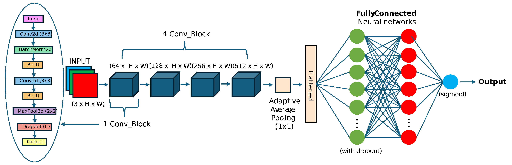

# CS1430 (Computer Vision) Final Project: Evaluating Fourier Transform Features for Detection of AI-Generated Images

## Abstract
This project evaluates the addition of Fourier Transforms into CNN models designed to distinguish real images from AI-generated ones, addressing challenges posed by the rise of hyperrealistic content produced by AI. Using the CIFAKE dataset, we implement a CNN architecture with Fourier Transform features to evaluate the model's success in classifying synthetic images. Our hypothesis is that incorporating frequency information via Fourier Transforms, in addition to spatial domain information, into a CNN can enhance the detection of AI-generated images by leveraging subtle frequency inconsistencies. This was ultimately disproved by our research, as our best-performing baseline CNN achieved a testing accuracy of 98.58%, while our Fourier-based model reached an accuracy of 98.50%.

## Introduction
As chatbots and generative AI become more sophisticated, technologies can create hyperrealistic fake images that are nearly impossible for an individual to discern. Our project focuses on verifying digital content's authenticity using CNNs enhanced with Fourier Transform features.

## Dataset
- CIFAKE dataset: 120,000 total images
    - 60,000 AI-generated images from latent diffusion models
    - 60,000 real images from CIFAR-10 classes
- Training set: 100,000 images
- Test set: 20,000 images

## Methods
We implemented several model architectures:
1. Baseline CNN model (98.58% accuracy)
        
2. Fourier Transform only model (82.53% accuracy)
        
3. CNN with concatenated frequency data
        
4. Combined parallel architectures
        

### Technical Details
- Learning rate: 1e-3
- Number of epochs: 50
- Dropout rate: 0.3
- No data augmentation
- All models kept under 10M parameters
- Training performed on Brown's OSCAR GPU cluster

## Results
### Model Performance
| Model | Test Accuracy |
|-------|---------------|
| Original CNN | 98.58% |
| Fourier Transform only | 82.53% |
| Concatenated Fourier (Random Noise) | 50.35% |
| Concatenated Fourier (Transform) | 95.36% |
| Combined Parallel (Random Noise) | 98.50% |
| Combined Parallel (Transform) | 98.50% |

## Conclusion
While Fourier Transforms contain information about whether an image is AI-generated, incorporating frequency features into CNN models did not improve results nor provide added value. Future work should focus on datasets with higher resolution images and more diverse content.

## Team Members
- **Sami Nourji**: Project management, architecture design, experimentation
- **Everest Yang**: Fourier Transform integration, literature review, documentation
- **Sujith Pakala**: GPU cluster setup, model implementation
- **Tanay Subramanian**: Literature research, baseline model development

## Presentation
[Research Presentation](https://docs.google.com/presentation/d/1riuebD4uW5ZjYBOXnilTC_b8eFHUnTPdp-qzGSgNB9I/edit?usp=sharing)

## Citation
```bibtex
@article{nourji2024aidetection,
    title={Evaluating Fourier Transform Features for Detection of AI-Generated Images},
    author={Nourji, Sami and Yang, Everest and Pakala, Sujith and Subramanian, Tanay},
    institution={Brown University},
    department={Department of Computer Science},
    course={CSCI 1430: Computer Vision},
    year={2024}
}
```
